# Schülerverwaltung mit Quasar – Frontend

Eine Verwaltungs-App mit Bewertungsfunktion für Schüler.

**Team: Benjamin Bulis, Simon Schachenhofer, Emre Yesildag**


### Beschreibung

Aufgabe war es, die in VueJS geschriebene Schülerverwaltungs-App aus dem vorigen Semester um eine Bewertungsfunktion zu erweitern. Dafür sollte ein komponentenbasiertes VueJS-Framework eingesetzt werden. Ich habe mich für Quasar entschieden.

Hier ein Screenshot der fertigen App:

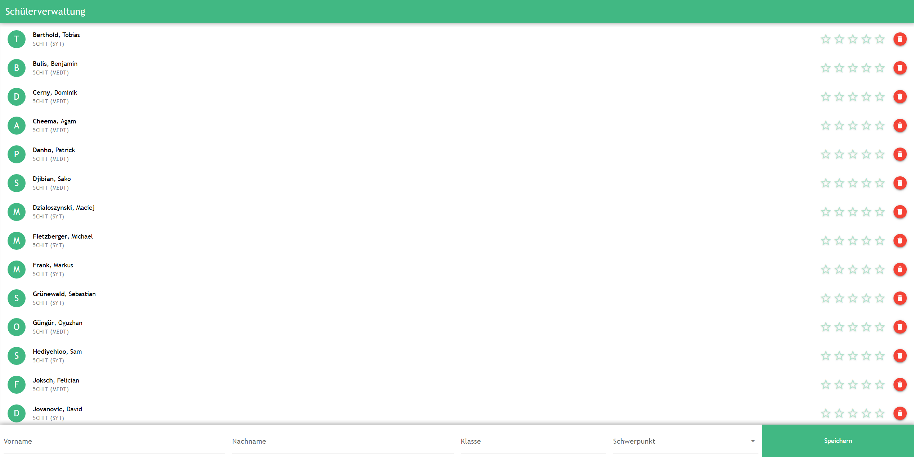


### Installation und Erstellung des Projektes

Das Besondere an Quasar ist, dass es nicht einfach nur eine JavaScript-Library ist, die man mit einem `<script>`-Tag in der Webseite einbindet. Diese Möglichkeit gibt es auch – noch viel praktischer ist aber die CLI-Edition von Quasar, die man am Server installiert. Quasar kann dann, wenn man die App ausführt, zum Beispiel *Hot Module Replacements* durchführen und geänderten Quelltext in die laufende App einspielen. Außerdem bietet Quasar die Möglichkeit, die App nicht nur als Web-App, sondern auch als Desktop- oder Mobile-App zu deployen.

Ich habe deshalb die Quasar CLI mit dem Befehl `sudo npm install -g @quasar/cli` am Server installiert.

In weiterer Folge habe ich ein Verzeichnis für alle Quasar-Projekte erstellt und darin `quasar create schuelerverwaltung` aufgerufen, um das Projekt *schuelerverwaltung* zu erstellen. Dabei muss man über die Command Line einige Fragen beantworten (z.B. Name, Projektbeschrebung) und Optionen auswählen (z.B. JavaScript-Linter). Quasar erstellt dann ein Verzeichnis mit der Grundstruktur des Projekts und Bootstrap-Code, den man mit `quasar dev` bereits ausführen kann.


### Components

Quasar bietet bereits eine große Auswahl an verschiedensten VueJS-Components an, die man im Projekt einsetzen kann. Davon habe ich unter Anderem `QLayout`, `QToolbar`, `QForm`, `QInput`, `QSelect`, `QList`, `QItem` und `QRating` verwendet.

Ich habe aber auch drei Komponenten selbst definiert: `StudentInputForm`, `StudentList` und `StudentItem`. Ich habe dafür das Konzept der *Single File Components* angewendet, habe also für jeden dieser Components eine eigene Datei angelegt. Diese Dateien liegen im Verzeichnis `src/components`. Sie gliedern sich jeweils in zwei Teile:

- Der `<template>`-Teil enthält HTML-Code. Er definiert, wie der Component auf der Seite dargestellt wird.
- Der `<script>`-Teil enthält JavaScript-Code. Hier werden die Funktionen des Components definiert. Dazu gehören unter Anderem `props`- und `data`-Variablen sowie die Methoden, über die der Component verfügt.


#### `StudentInputForm.vue`

`StudentInputForm` ist der Component für das Eingabeformular am unteren Bildschirmrand. Über dieses Formular kann man neue Schüler hinzufügen.

``````vue
<template>
    <q-form @submit.prevent="addStudent" class="row">
      <q-input id="add-student-firstname" class="col-md-3 col-sm-6 col-xs-12 q-pa-sm" style="box-sizing: border-box;" v-model.trim="firstname" label="Vorname"></q-input>
      <q-input id="add-student-lastname" class="col-md-3 col-sm-6 col-xs-12 q-pa-sm" style="box-sizing: border-box;" v-model.trim="lastname" label="Nachname"></q-input>
      <q-input id="add-student-class" class="col-md-2 col-sm-6 col-xs-12 q-pa-sm" style="box-sizing: border-box;" v-model.trim="schoolclass" label="Klasse"></q-input>
      <q-select id="add-student-subject" class="col-md-2 col-sm-6 col-xs-12 q-pa-sm" style="box-sizing: border-box;" :options="subjects" v-model="subject" label="Schwerpunkt"></q-select>

      <input type="submit" id="add-student-submit" class="inline col-md-1 col-sm-12 col-xs-12" style="box-sizing: border-box;" value="Speichern">
    </q-form>
</template>

<script>
export default {
  name: 'student-input-form',

  data () {
    return {
      firstname: '',
      lastname: '',
      schoolclass: '',
      subject: '',

      subjects: ['MEDT', 'SYT', 'NWTK']
    }
  },

  methods: {
    /**
     * Add a new student to the database. The properties of the new student are read from the input form.
     * All fields of the input form must be filled out. If that is not the case, an error message will be displayed,
     * prompting the user to fill out the empty fields.
     * If the student was added successfully, the form will be reset
     */
    addStudent: async function () {
      // Check for empty input fields
      if (!(this.firstname === '') && !(this.lastname === '') && !(this.schoolclass === '')) {
        // Call addStudent function of root component
        if (await this.$root.addStudent(this.firstname, this.lastname, this.schoolclass, this.subject)) {
          // Reset the form
          this.firstname = ''
          this.lastname = ''
          this.schoolclass = ''
          this.subject = ''
        }
      } else {
        // Show error notification
        this.$q.notify({
          type: 'warning',
          message: 'Bitte alle Eingabefelder ausfüllen',
          icon: 'notification_important',
          group: 'FORM_FIELDS_UNFILLED',
          position: 'top',
          timeout: 3000
        })
      }
    }
  }
}
</script>
``````

Dargestellt wird dieser Component als Formular (`QForm`) mit drei Eingabefeldern, einem Dropdown und einem Submit-Button. Die Eingabefelder sind mit der `v-model`-Directive mit den `data`-Variablen `firstname`, `lastname`, `schoolclass` und `subject` verknüpft. Dadurch enthalten diese Variablen immer automatisch den Wert, der gerade im Eingabefeld steht. Wenn der Benutzer auf der Webseite etwas eingibt, wird das sofort in die Variablen übernommen. Umgekehrt übernehmen auch die Eingabefelder Änderungen der Variablen.

`StudentInputForm` hat keine `props`-Variablen. Dafür hat er aber fünf `data`-Variablen: Die vier, die für `v-model` gebraucht werden, sowie ein Array, dass die drei Optionen für das Dropdown enthält. Diese Optionen werden mit `:options` dem Dropdown zugewiesen.

Als einzige Methode besitzt der Component `addStudent()`. Über diese Methode kann ein neuer Schüler hinzugefügt werden. Es werden dabei die eingegebenen Daten aus den Variablen ausgelesen und an den `$root`-Component übergeben (siehe [Bootfile](#Bootfile)).

Hier sieht man auch schon die erste Verwendung von `Notify`, einem Quasar-Plugin, das ich verwendet habe, um Fehlermeldungen anzuzeigen.

Die zweite Zeile des `<script>`-Teils (`name: 'student-input-form'`) legt fest, dass der Component im HTML-Quelltext nicht als `<StudentInputForm>` eingebunden wird, sondern als `<student-input-form>`.


#### `StudentList.vue`

`StudentList` ist dafür verantwortlich, die existierenden Schüler in einer Liste anzuzeigen. Es handelt sich um einen eher einfachen Component, der keine `data`-Variablen und auch keine Methoden besitzt.

``````vue
<template>
  <q-list bordered>
    <student-item v-for="student in students" :student="student" :key="student.lastname"></student-item>
  </q-list>
</template>

<script>
export default {
  name: 'student-list',

  data () {
    return {}
  },

  props: {
    students: {
      type: Array,
      default: () => []
    }
  }
}
</script>
``````

Hier sieht man, dass `StudentList` als eine `QList` dargestellt wird. Diese Liste enthält dann für jeden einzelnen Schüler ein `StudentItem`.

Die Liste der Schüler wird als Property (`props`-Variable) übergeben, es handelt sich um ein Array. Die `v-for`-Directive bewirkt, dass dieses Array mit einer foreach-Schleife durchlaufen wird und für jedes Element ein `StudentItem` hinzugefügt wird. Dabei wird jeweils das Element (also das Schüler-Objekt) selbst wieder als Property an den `StudentItem`-Component weitergegeben. Das Attribut `:key` wird von VueJS als eine Art „Primary Key“ benötigt, um Änderungen in den Daten effizienter darstellen zu können.


#### `StudentItem.vue`

`StudentItem` stellt innerhalb der `StudentList`-Liste einen einzelnen Schüler dar.

``````vue
<template>
  <q-item class="q-my-sm">
    <q-item-section avatar>
      <q-avatar color="primary" text-color="white">
        {{ student.firstname.charAt(0) }}
      </q-avatar>
    </q-item-section>

    <q-item-section>
      <q-item-label size="2em"><b>{{ student.lastname }}</b>, {{ student.firstname }}</q-item-label>
      <q-item-label caption size="1.5em" lines="1">{{ `${student.schoolclass} (${student.subject})` }}</q-item-label>
    </q-item-section>

    <q-item-section side>
      <q-rating v-model="student.rating" icon="star_border" icon-selected="star" size="2em" color="primary" @input="rate"></q-rating>
    </q-item-section>

    <q-item-section side>
      <q-btn round color="red-6" icon="delete" size="sm" @click="remove"/>
    </q-item-section>
  </q-item>
</template>

<script>
export default {
  name: 'student-item',

  data () {
    return {}
  },

  props: {
    student: {
      id: {
        type: Number
      },
      firstname: {
        type: String,
        default: ''
      },
      lastname: {
        type: String,
        default: ''
      },
      schoolclass: {
        type: String,
        default: ''
      },
      subject: {
        type: String,
        default: 'MEDT'
      },
      rating: {
        type: Number,
        default: 0
      }
    }
  },

  methods: {
    /**
     * Rate the student with a rating in the range [0, 5]
     *
     * @param {Number} rating - The rating for the student
     */
    rate: function (rating) {
      this.$root.rateStudent(this.student.id, rating)
    },

    /**
     * Remove the student from the database
     */
    remove: function () {
      this.$root.removeStudent(this.student.id)
    }
  }
}
</script>
``````

Es handelt sich um ein `QItem` – also ein Element innerhalb der `QList`. Das ganze sieht so aus:

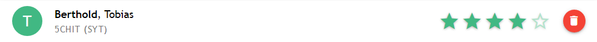

Links im grünen Kreis steht der erste Buchstabe des Vornamens. Das wird im `<template>` über `{{ student.firstname.charAt(0) }}` festgelegt. Rechts davon stehen der Name (`<b>{{ student.lastname }}</b>, {{ student.firstname }}`) sowie Klasse und Schwerpunkt (```{{ `${student.schoolclass} (${student.subject})` }}```). Die Daten, die angezeigt werden, kommen von der Property `student`, die – siehe [oben](#StudentList.vue) – von der `StudentList` übergeben wird.

Auf der rechten Seite hat man die Möglichkeit, den Schüler mit Sternen zu bewerten. Dafür habe ich den Quasar-Component `QRating` benutzt. Über `v-model` ist die Bewertung mit dem Attribut `rating` der `student`-Property verknüpft. Über `@input` ist außerdem ein Event-Handler festgelegt: Wenn sich der Wert des `QRating`-Components ändert, wird die Methode `rate(Number)` aufgerufen.

Es gibt außerdem einen Button, mit dem man den Schüler löschen kann. Auch hier ist mit `@click` ein Event-Handler festgelegt: Durch Klicken wird die Methode `remove()` aufgerufen.

Die beiden Methoden führen das Bewerten bzw. Löschen nicht selbst durch, sondern rufen die entsprechenden Methoden des `$root`-Components auf. Dabei übergeben sie auch die ID des Schülers.


### Bootfile

In Bootfiles wird die VueJS-App initialisiert und konfiguriert. Ich habe ein einziges Bootfile benutzt: `boot/components.js`. In dieser Datei passiert folgendes:

- Die drei selbst definierten [Components](#Components) werden importiert und eingebunden.

- Es werden die Variablen festgelegt, mit denen die App arbeitet:

  - Zwei `data`-Variablen, nämlich die Liste der Schüler und die URL der dahinterliegenden REST API.
  - Eine `computed`-Variable. Dabei handelt sich um eine Variable, die „berechnet“ wird, wenn sie benötigt wird. Hier wird einfach die Schülerliste nach Nachnamen sortiert.

- Es werden Methoden definiert:

  - `addStudent()`, um einen Schüler hinzuzufügen – diese Methode wird vom Component `StudentInputForm()` benutzt
  - `rateStudent()`, um einen Schüler zu bewerten, sowie `removeStudent()`, um einen Schüler zu löschen – diese beiden Methoden werden vom Component `StudentItem` benutzt
  - `reload()`, um die Schülerliste neu von der API zu laden

  All diese Methoden greifen mit `fetch()` auf die API zu.

- Außerdem wird über `app.mounted` definiert, was passieren soll, wenn die App fertig initialisiert ist: Mit der Methode `reload()` sollen die Schülerdaten von der API abgerufen werden.

``````javascript
import StudentItem from '../components/StudentItem'
import StudentList from '../components/StudentList'
import StudentInputForm from '../components/StudentInputForm'

export default ({ app, Vue }) => {
  // Add the three custom components to the Vue app
  Vue.component('student-item', StudentItem)
  Vue.component('student-list', StudentList)
  Vue.component('student-input-form', StudentInputForm)

  app.data = () => {
    return {
      apiBase: 'http://medt.school.bulis.xyz/api', // Change this to the base URL of the REST API

      students: [] // The array that will hold the student objects
    }
  }

  app.computed = {
    studentsSorted: function () {
      // The student objects, sorted by their surname in ascending order
      return this.students.sort((s1, s2) => {
        return (s1.lastname < s2.lastname) ? -1 : (s1.lastname > s2.lastname)
      })
    }
  }

  app.methods = {
    /**
     * Add a new student to the database
     *
     * @param {string} firstname - The first name of the student
     * @param {string} lastname - The last name of the student
     * @param {string} schoolclass - The class of the student
     * @param {string} subject - The focus subject of the student
     *
     * @returns {Boolean} true if the student was added successfully, false otherwise
     */
    addStudent: async function (firstname, lastname, schoolclass, subject) {
      const headers = new Headers()
      headers.append('Content-Type', 'application/json')

      try {
        // Send a HTTP POST request to the API
        const resp = await fetch(`${this.apiBase}/student`, {
          method: 'POST',
          body: JSON.stringify({
            firstname: firstname,
            lastname: lastname,
            schoolclass: schoolclass,
            subject: subject,
            rating: 0 // Default rating is always 0
          }),
          headers: headers
        })

        if (resp.ok) {
          // Reload the students from the API so that the new student is also included
          this.reload()
          return true
        } else {
          // Display an error message
          this.$q.notify({
            type: 'negative',
            message: 'Der Schüler konnte nicht hinzugefügt werden',
            icon: 'error',
            group: 'ADD_STUDENT_ERROR',
            position: 'top',
            timeout: 3000
          })
          return false
        }
      } catch (error) {
        console.log(error)

        // A JavaScript error occured (e.g. no internet connection) - display an error message
        this.$q.notify({
          type: 'negative',
          message: 'Der Schüler konnte nicht hinzugefügt werden',
          icon: 'error',
          group: 'ADD_STUDENT_ERROR',
          position: 'top',
          timeout: 3000
        })

        return false
      }
    },

    /**
     * Rate a student with a score ranging from 1 to 5
     *
     * @param {Number} id - The ID of the student to rate
     * @param {Number} rating - The rating, an integer Number in the range [0, 5]
     *
     * @returns {Boolean} true if the student was rated successfully, false otherwise
     */
    rateStudent: async function (id, rating) {
      if (rating < 0 || rating > 5) {
        // The rating must be between 0 and 5 - display an error message
        this.$q.notify({
          type: 'negative',
          message: 'Die Bewertung muss zwischen 0 und 5 liegen',
          icon: 'error',
          group: 'ILLEGAL_RATING_ERROR',
          position: 'top',
          timeout: 3000
        })

        return false
      }

      // Find the student in the array and update the rating
      const s = this.students.find(elem => elem.id === id)
      s.rating = rating

      try {
        // Send a PUT request to the server including the new student
        const resp = await fetch(`${this.apiBase}/student/${id}`, {
          method: 'PUT',
          body: JSON.stringify(s, ['firstname', 'lastname', 'schoolclass', 'subject', 'rating']) // Only include those 5 properties in the PUT request
        })

        if (resp.ok) {
          // Reload the students from the API so that the student has the new rating
          this.reload()
          return true
        } else {
          // Display an error message
          this.$q.notify({
            type: 'negative',
            message: 'Der Schüler konnte nicht bewertet werden',
            icon: 'error',
            group: 'RATE_STUDENT_ERROR',
            position: 'top',
            timeout: 3000
          })
          return false
        }
      } catch (error) {
        console.log(error)

        // A JavaScript error occured (e.g. no internet connection) - display an error message
        this.$q.notify({
          type: 'negative',
          message: 'Der Schüler konnte nicht bewertet werden',
          icon: 'error',
          group: 'RATE_STUDENT_ERROR',
          position: 'top',
          timeout: 3000
        })

        return false
      }
    },

    /**
     * Reload the students from the API
     */
    reload: async function () {
      try {
        // GET request all students from the API
        const resp = await fetch(`${this.apiBase}/student`)

        if (resp.ok) {
          // Parse the returned JSON and set this.students to the returned data
          this.students = (await resp.json()).data
        } else {
          // Reset the students array and display an error message
          this.students = []

          this.$q.notify({
            type: 'negative',
            message: 'Die Schülerdaten konnten nicht abgerufen werden',
            icon: 'error',
            group: 'LOAD_STUDENTS_ERROR',
            position: 'top',
            timeout: 3000
          })
        }
      } catch (error) {
        console.log(error)

        // A JavaScript error occured (e.g. no internet connection) - display an error message
        this.$q.notify({
          type: 'negative',
          message: 'Die Schülerdaten konnten nicht abgerufen werden',
          icon: 'error',
          group: 'LOAD_STUDENTS_ERROR',
          position: 'top',
          timeout: 3000
        })
      }
    },

    /**
     * Remove a student from the database
     *
     * @param {Number} id - The ID of the student to be removed
     *
     * @returns {Boolean} true if the student was removed successfully, false otherwise
     */
    removeStudent: async function (id) {
      try {
        // Send the DELETE request to the server
        const resp = await fetch(`${this.apiBase}/student/${id}`, {
          method: 'DELETE'
        })

        if (resp.ok) {
          // Reload the student data so that the new student is removed
          this.reload()
          return true
        } else {
          // Display an error message
          this.$q.notify({
            type: 'negative',
            message: 'Der Schüler konnte nicht entfernt werden',
            icon: 'error',
            group: 'REMOVE_STUDENT_ERROR',
            position: 'top',
            timeout: 3000
          })
          return false
        }
      } catch (error) {
        console.log(error)

        // A JavaScript error occured (e.g. no internet connection) - display an error message
        this.$q.notify({
          type: 'negative',
          message: 'Der Schüler konnte nicht entfernt werden',
          icon: 'error',
          group: 'REMOVE_STUDENT_ERROR',
          position: 'top',
          timeout: 3000
        })

        return false
      }
    }
  }

  app.mounted = function () {
    // On startup, load the students from the API
    this.reload()
  }
}
``````


### Hauptseite

Was im [Bootfile](#Bootfile) noch fehlt, ist die Darstellung der App. Das habe ich in der Datei `MainLayout.vue` festgelegt:

``````vue
<template>
  <q-layout view="hHh lpR fFf">

    <q-header elevated class="bg-primary text-white">
      <q-toolbar>
        <q-toolbar-title>
          Schülerverwaltung
        </q-toolbar-title>
      </q-toolbar>
    </q-header>

    <q-page-container>
      <student-list :students="this.$root.studentsSorted"/>
    </q-page-container>

    <q-footer elevated class="bg-white">
      <student-input-form/>
    </q-footer>

  </q-layout>
</template>

<script>
export default {
  data () {
    return {}
  }
}
</script>
``````

Hier wird die grundlegende Struktur der Seite festgelegt: Ein `QHeader` mit dem Titel, dann die Seite mit der `StudentList`, und unten ein `QFooter` mit dem `StudentInputForm`-Eingabeformular.

Auch hierbei handelt es sich eigentlich um einen VueJS-Component mit einem eigenen `<script>`-Bereich, in dem Variablen und Methoden definiert werden könnten. Ich habe mich aber dafür entschieden, das stattdessen im Bootfile zu tun.


### Konfiguration

Damit das Projekt so funktioniert, musste ich die Konfiguration leicht abändern. Die Konfiguration ist in der Datei `quasar.conf.js` festgelegt. Konkret habe ich zwei Dinge ändern müssen:

- Das Bootfile `components.js` eintragen, damit es auch ausgeführt wird
- Das Plugin `Notify` aktivieren

``````js
// Configuration for your app
// https://quasar.dev/quasar-cli/quasar-conf-js

module.exports = function (ctx) {
  return {
    // app boot file (/src/boot)
    // --> boot files are part of "main.js"
    // https://quasar.dev/quasar-cli/cli-documentation/boot-files
    boot: [
      'components.js'
    ],

    // https://quasar.dev/quasar-cli/quasar-conf-js#Property%3A-css
    css: [
      'app.sass'
    ],

    // https://github.com/quasarframework/quasar/tree/dev/extras
    extras: [
      // 'ionicons-v4',
      // 'mdi-v4',
      // 'fontawesome-v5',
      // 'eva-icons',
      // 'themify',
      // 'line-awesome',
      // 'roboto-font-latin-ext', // this or either 'roboto-font', NEVER both!

      'roboto-font', // optional, you are not bound to it
      'material-icons' // optional, you are not bound to it
    ],

    // https://quasar.dev/quasar-cli/quasar-conf-js#Property%3A-framework
    framework: {
      iconSet: 'material-icons', // Quasar icon set
      lang: 'en-us', // Quasar language pack

      // Possible values for "all":
      // * 'auto' - Auto-import needed Quasar components & directives
      //            (slightly higher compile time; next to minimum bundle size; most convenient)
      // * false  - Manually specify what to import
      //            (fastest compile time; minimum bundle size; most tedious)
      // * true   - Import everything from Quasar
      //            (not treeshaking Quasar; biggest bundle size; convenient)
      all: 'auto',

      components: [],
      directives: [],

      // Quasar plugins
      plugins: [
        'Notify'
      ]
    },

    // https://quasar.dev/quasar-cli/cli-documentation/supporting-ie
    supportIE: false,

    // Full list of options: https://quasar.dev/quasar-cli/quasar-conf-js#Property%3A-build
    build: {
      vueRouterMode: 'hash', // available values: 'hash', 'history'

      // showProgress: false,
      // gzip: true,
      // analyze: true,

      // Options below are automatically set depending on the env, set them if you want to override
      // preloadChunks: false,
      // extractCSS: false,

      // https://quasar.dev/quasar-cli/cli-documentation/handling-webpack
      extendWebpack (cfg) {
        cfg.module.rules.push({
          enforce: 'pre',
          test: /\.(js|vue)$/,
          loader: 'eslint-loader',
          exclude: /node_modules/,
          options: {
            formatter: require('eslint').CLIEngine.getFormatter('stylish')
          }
        })
      }
    },

    // Full list of options: https://quasar.dev/quasar-cli/quasar-conf-js#Property%3A-devServer
    devServer: {
      https: false,
      port: 8080,
      open: true // opens browser window automatically
    },

    // animations: 'all', // --- includes all animations
    // https://quasar.dev/options/animations
    animations: [],

    // https://quasar.dev/quasar-cli/developing-ssr/configuring-ssr
    ssr: {
      pwa: false
    },

    // https://quasar.dev/quasar-cli/developing-pwa/configuring-pwa
    pwa: {
      workboxPluginMode: 'GenerateSW', // 'GenerateSW' or 'InjectManifest'
      workboxOptions: {}, // only for GenerateSW
      manifest: {
        name: 'Schülerverwaltung',
        short_name: 'Schülerverwaltung',
        description: 'Eine Verwaltungs-App für Schüler',
        display: 'standalone',
        orientation: 'portrait',
        background_color: '#ffffff',
        theme_color: '#027be3',
        icons: [
          {
            src: 'statics/icons/icon-128x128.png',
            sizes: '128x128',
            type: 'image/png'
          },
          {
            src: 'statics/icons/icon-192x192.png',
            sizes: '192x192',
            type: 'image/png'
          },
          {
            src: 'statics/icons/icon-256x256.png',
            sizes: '256x256',
            type: 'image/png'
          },
          {
            src: 'statics/icons/icon-384x384.png',
            sizes: '384x384',
            type: 'image/png'
          },
          {
            src: 'statics/icons/icon-512x512.png',
            sizes: '512x512',
            type: 'image/png'
          }
        ]
      }
    },

    // Full list of options: https://quasar.dev/quasar-cli/developing-cordova-apps/configuring-cordova
    cordova: {
      // noIosLegacyBuildFlag: true, // uncomment only if you know what you are doing
      id: 'org.cordova.quasar.app'
    },

    // Full list of options: https://quasar.dev/quasar-cli/developing-capacitor-apps/configuring-capacitor
    capacitor: {
      hideSplashscreen: true
    },

    // Full list of options: https://quasar.dev/quasar-cli/developing-electron-apps/configuring-electron
    electron: {
      bundler: 'packager', // 'packager' or 'builder'

      packager: {
        // https://github.com/electron-userland/electron-packager/blob/master/docs/api.md#options

        // OS X / Mac App Store
        // appBundleId: '',
        // appCategoryType: '',
        // osxSign: '',
        // protocol: 'myapp://path',

        // Windows only
        // win32metadata: { ... }
      },

      builder: {
        // https://www.electron.build/configuration/configuration

        appId: 'schuelerverwaltung'
      },

      // More info: https://quasar.dev/quasar-cli/developing-electron-apps/node-integration
      nodeIntegration: true,

      extendWebpack (cfg) {
        // do something with Electron main process Webpack cfg
        // chainWebpack also available besides this extendWebpack
      }
    }
  }
}
``````


### Screenshots

Die Web-App ist responsiv und passt sich an verschiedene Bildschirmgrößen an. Ich habe deshalb die Screenshots in jeweils drei unterschiedlichen Bildschirmgrößen gemacht:

- Desktop-PC
- Tablet (iPad) – über die Firefox-Entwicklerkonsole emuliert
- Smartphone (iPhone X) – über die Firefox-Entwicklerkonsole emuliert

#### Layout der App

Am Desktop-PC:


Am Tablet:

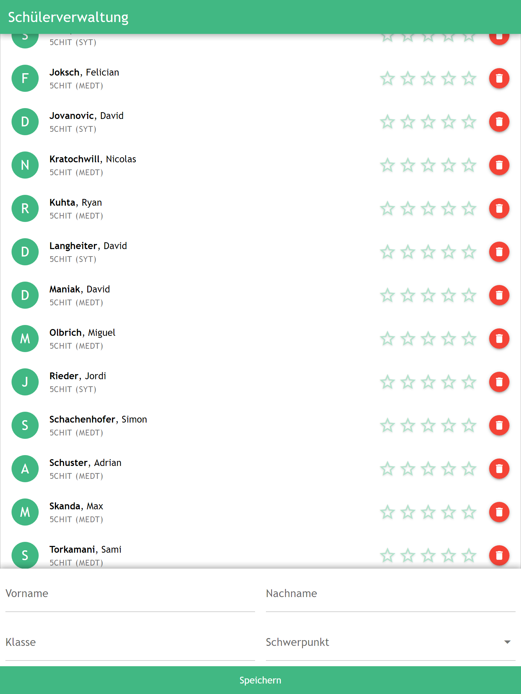

Am Smartphone:

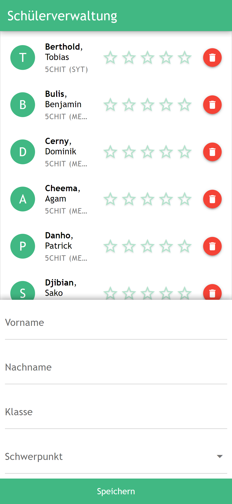


#### Bewertete Schüler

Am Desktop-PC:


Am Tablet:

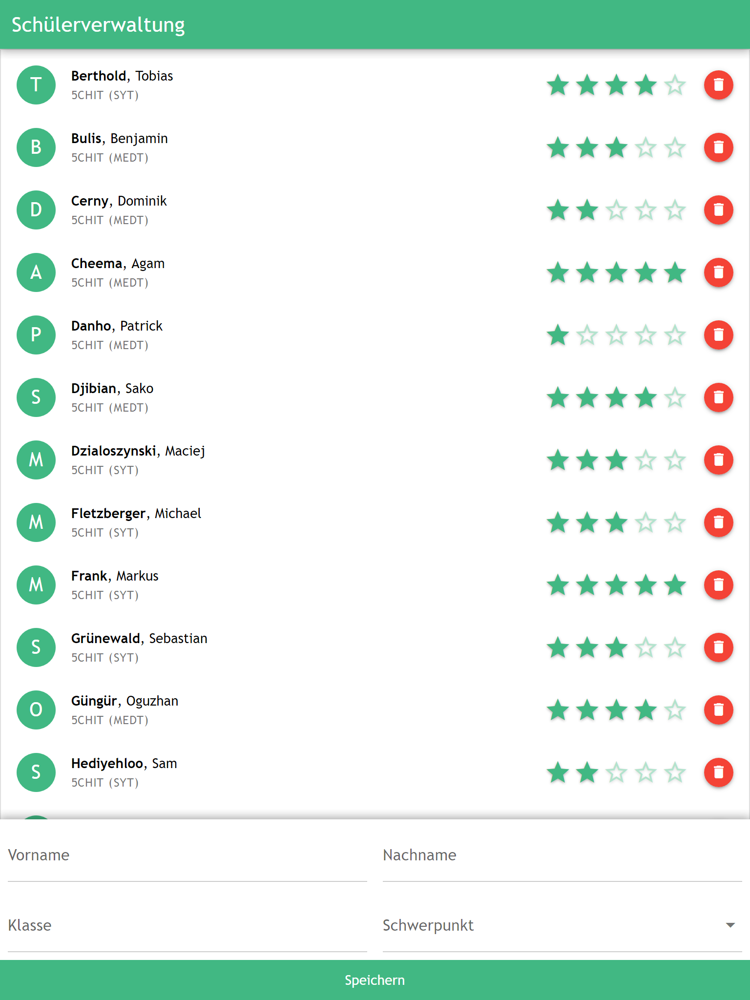

Am Smartphone:

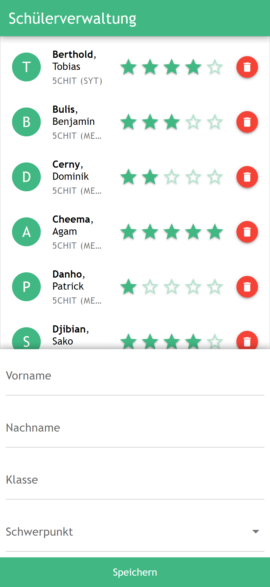


#### Fehlermeldung (*Error*)

Am Desktop-PC:

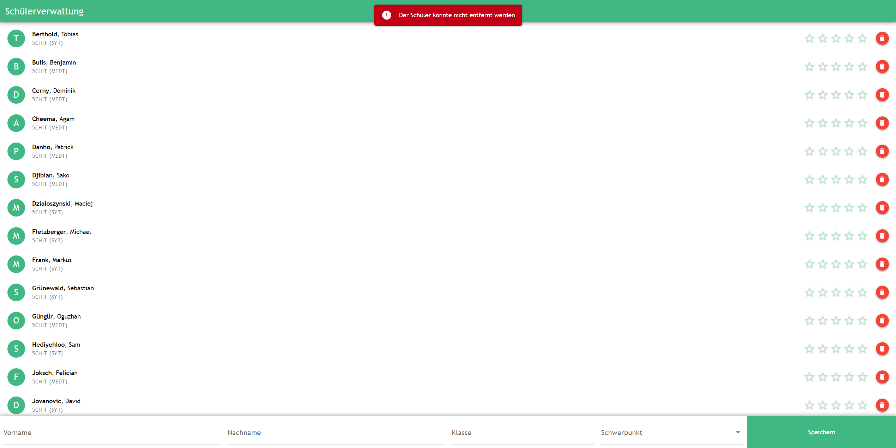

Am Tablet:

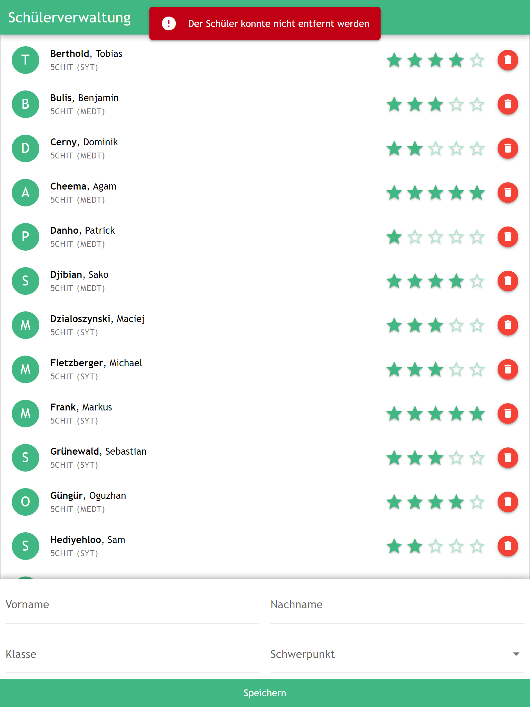

Am Smartphone:

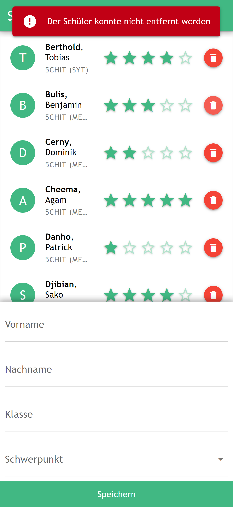


#### Warnung (*Warning*)

Am Desktop-PC:

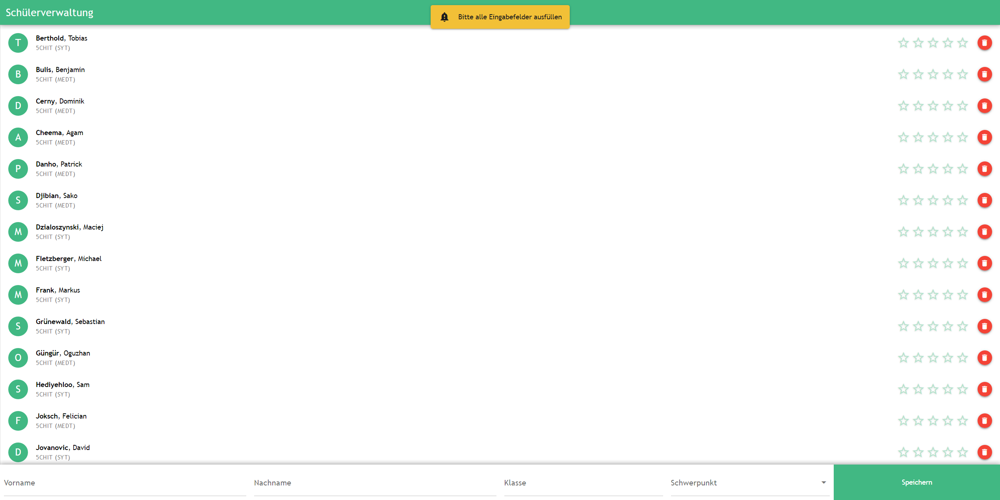

Am Tablet:

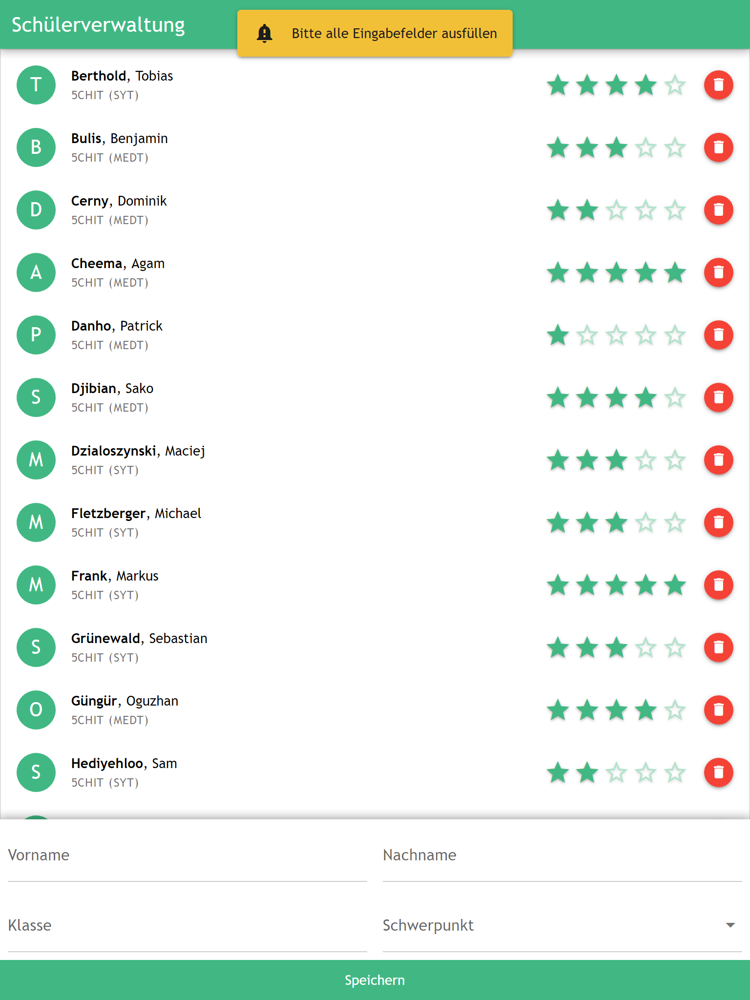

Am Smartphone:

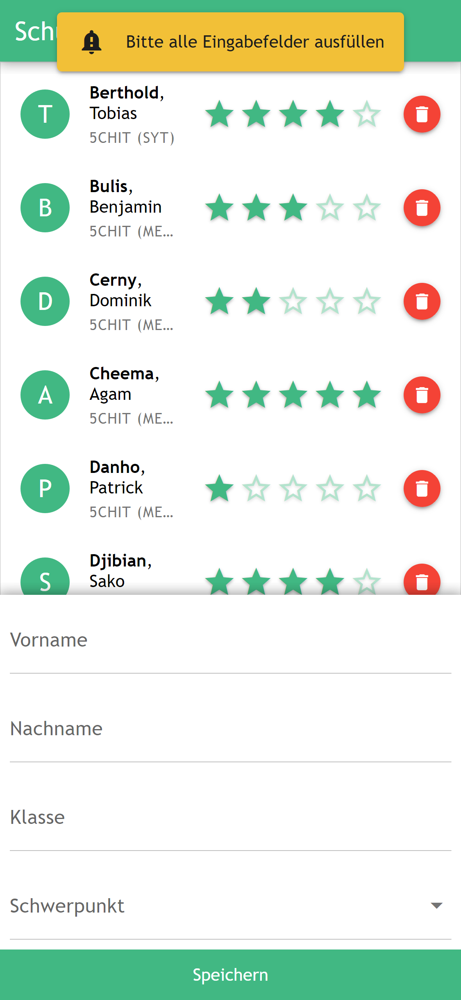